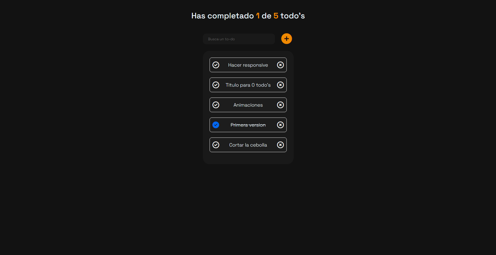

# WEATHER WIZARD

## Tabla de contenidos

- [Descripcion](#descripcion)
  - [El desafio](#el-desafio)
  - [Screenshot](#screenshot)
  - [Links](#links)
- [Mi proceso](#mi-proceso)
  - [Hecho con](#hecho-con)
  - [Lo aprendido](#lo-que-aprendi)
  - [En desarrollo](#en-desarrollo)
- [Autor](#autor)

## Descripcion

Aplicativo administrador de tareas, permite filtrar, agregar, eliminar, marcar o desmarcar las diferentes tareas (TO DO's)

## El desafio

El usuario deberia poder

- Ver el layout optimo dependiendo de su tamano de pantalla.
- Ver el listado de to do's y poder manipularlo
- Ver la interaccion cuando se coloca el mouse encima de los elementos.
- Crear, filtrar, eliminar, marcar o desmarcar sus tareas pendientes.
- Guardar en local storage la informacion cada vez que recargue la pagina automaticamente
- Abrir un modal para agregar nuevas tareas
- Mostrar una interfaz de carga

## Screenshot

## Links

- Repositorio: [GITHUB](https://github.com/J-HernandezM/to-do-list)
- Deploy: [PAGES](https://j-hernandezm.github.io/to-do-list/)

## Mi proceso

Este es el primer aplicativo que hago con React, me siento contento con el resultado. Siento que los demas cursos que he realizado hasta ahora me facilitaron entender los conceptos aqui presentados, hay partes que todavia se me dificultan pero mas que todo en los estilos. El tema de logica y demas lo logre entender bastante bien.

## Hecho con

- Semantic HTML5 markup
- CSS custom properties
- Flexbox
- CSS Grid
- Mobile-first workflow
- Simple JavaScript
- Create React App
- React
- localStorage Web API

## Lo que aprendi

Siento que aprendi bastante de los hooks de React y los diferentes usos que le puedo dar para solucionar problemas de manera mas facil que suando vanilla JS.

Ademas aprendi el uso de nuevas funcionalidades de interfaz como modales y loading skeletons y demas trucos con CSS que me ayudaron a tener una pagina mucho mas viva pero usando React en este caso.

## En desarrollo

Queda pendiente para agregar a la aplicacion ciertas validaciones a los inputs para evitar que el usuario anada tareas sumamente largas y arruinen la interfaz. Ademas tambien manejar los contenedores para que admitan tareas mas largas que simplemente dos o tres palabras.

## Autor

- Website - [Portfolio en construccion](https://j-hernandezm.github.io)
- Github - [@J-HernandezM](https://github.com/J-HernandezM)
- Twitter - [@__HernandezM](https://www.twitter.com/__HernandezM)